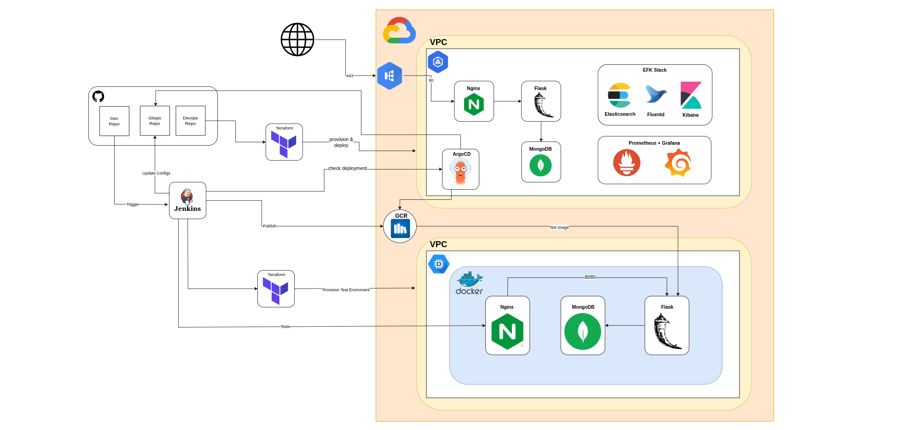

# Tom Devops Portfolio

A personal project that incorporates Devops methodologies and shows the full development process
from idea to coding and towards Continues Integration & Delivery

## General information regarding the project
This project has different technologies and methods implemented into it:
  * The main Website skeleton was developed by using basic HTML5 with javascript and css.
  * Backend and api services were written in python using flask.
  * DB queries are being done towards mongoDB.
  * docker-compose being used for testing environment and early testing.
  * Jenkins pipeline was implemented for CI/CD.
  * Helm chart for application deployment through ArgoCD.

## Git Strategies
  * Main based development.
  * Our main branch is our production.
  * Feature branches are our Dev branches per needed feature.

## Architecture
  

## Documentation Sources
* [Docker & Docker-Compose](https://www.docs.docker.com/)
* [Nginx](https://nginx.org/en/docs/)
* [K8S](https://kubernetes.io/docs/home/)
* [Helm](https://helm.sh/docs/)
* [mongoDB](https://www.mongodb.com/docs/)
* [Bitnami-Charts](https://github.com/bitnami/charts)
* [Jenkins](https://www.jenkins.io/doc/book/)
* [Terraform](https://www.terraform.io/docs)
* [GCP](https://cloud.google.com/docs)
* [ArgoCD](https://argo-cd.readthedocs.io/en/stable/)

# Happy Deploying